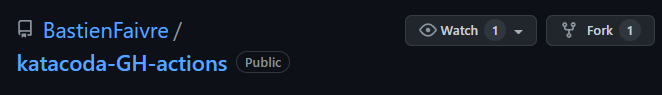

# Fork the nodeJS Project

The first task is to fork the [sample nodeJS project](https://github.com/BastienFaivre/katacoda-GH-actions). To achieve this, visit the repository link and click on the fork button at the top right of the page:



Once you have done that, you should enable GitHub Actions on your fork. This is done by going into the `Actions` tab and clicking the big green button.

# Choose your Environment

This tutorial can be done in 2 environments:

- Clone the forked repository on your machine and work locally (i.e. outside the web browser)

    You can simply clone the repository using your SSH key, use your favorite IDE to modify the files and finally commit and push the changes to test them

- Clone the forked repository in the katacoda environment and work in the web browser

    You can clone the repository in the katacoda shell using the HTTPS link. Then work on the provided VSCODE editor. To be able to commit and push the code, you need to generate an authorization token in your GitHub account settings. Please follow [this tutorial](https://docs.github.com/en/authentication/keeping-your-account-and-data-secure/creating-a-personal-access-token) to generate the access token. Note: make sure to select the *repo* section in the permissions. Afterwards, each time you want to push, you need to specify your GitHub username and give the access token as password.

    > NOTE: SAVE THIS TOKEN TO A FILE SOMEWHERE! You can only view it once. Make sure to delete it after the tutorial.

    Execute the following commands with your GitHub account name and email
    ```
    git config --global user.name "yourName"
    git config --global user.email "yourEmail@email.com"
    ```

    Alternately you could setup ssh keys on the katacoda enviroment, but be sure to delete them once you are done.
