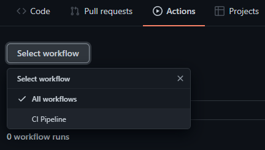
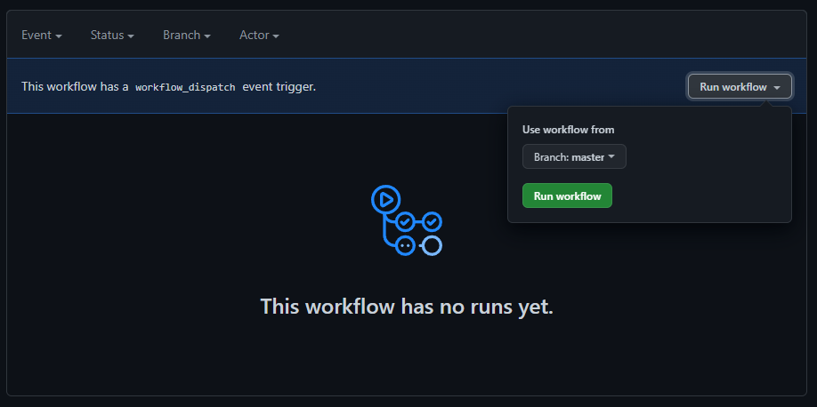

# Test Project

Once you have forked the sample project you should be able to edit it using the builtin editor on katacoda, or your favorite editor of choice if you are doing the tutorial locally

The forked repository is a simple "dummy" project that will be used just to test out the workflow. It consists of 2 implementations of simple arithmetic operations in the files `add.js` and `mult.js` with corresponding test files `add.test.js` `mult.test.js`. The project uses `jest` as the testing framework, and uses `eslint` for linting.

If we look in `package.json` we can see that this project has quite a few dependencies, this is for demonstrative purposes. Although, it is not uncommon for `js` projects to have disproportionately large amount of dependencies.

# The Initial Workflow

The initial workflow configuration is located in `.github/workflows/ci.yml`. We will walk through this example to familiarize with the syntax and structure of this file.

```
name: CI Pipeline

on: [pull_request, push, workflow_dispatch]
```

- `name` simply specifies the name of the workflow that will be displayed in the GitHub UI.

- `on` specifies on which events this workflow will be run. `pull_request` and `push` are pretty self explanatory. `workflow_dispatch` is the event that is fired when you manually run a pipeline from GitHub.

```
jobs:
```

- `jobs` is a required label that all actions must have, and it simply specifies the different jobs that are run in the pipeline. Each job is a self-contained sequence of actions that is run on its own virtual machine.

```
  test_n_lint:
    name: Test n' Lint
    runs-on: macos-latest
    steps:
      # Checkout source code and setup node version.
      - uses: actions/checkout@v2
      - uses: actions/setup-node@v2
        with:
          node-version: "16.x"

      # Install dependencies

      - name: Install Dependencies
        run: yarn install

      # Test n' Lint !

      - name: Lint
        run: yarn lint

      - name: Test
        run: yarn test
```

- `test_n_lint` is a user defined label that specifies a job.

  - `name` is once again the name that is displayed in the GitHub UI.

  - `runs-on` specifies what type of virtual machine the pipeline is run from. You have 3 choices, `macos`, `windows` and `ubuntu`. Depending on if you are targeting different platforms you will have to choose this property accordingly.

  - `steps` is a label under which we define the different steps that this job will preform. The steps can be named or unnamed. We have 3 named steps `Install Dependencies`, `Lint`, `Test` which are pretty self explanatory. `yarn lint` is an alias to `eslint` and `yarn test` is an alias to `jest` which is defined in `package.json`. We also make use of some pre-built actions provided by GitHub.

    - `actions/checkout@v2` is an action that clones the repository into the virtual machine. By default it does a shallow clone, meaning that only the previous commit will be cloned. You can find more info [here](https://github.com/actions/checkout).

    - `actions/setup-node@v2` is an action that helps us specify which version of versions of `node.js` we want to run our pipeline with. So for this actions we specify version `16.x`. You can find more info [here](https://github.com/actions/setup-node).


You can run the workflow by first going to the `Actions` tab in GitHub, selecting the workflow by pressing the `Select workflow` button.



and then triggering a `workflow_dispatch` event from the UI.



You can inspect the `CI Pipeline` by clicking it, and then you can inspect the `Test n' Lint` job by clicking it. You can also inspect the output of the individual steps by expanding them in the overview of the `Test 'n Lint` job.

This workflow should take about a minute or so to run. Great! Now we can move on to improving upon this pipeline!
